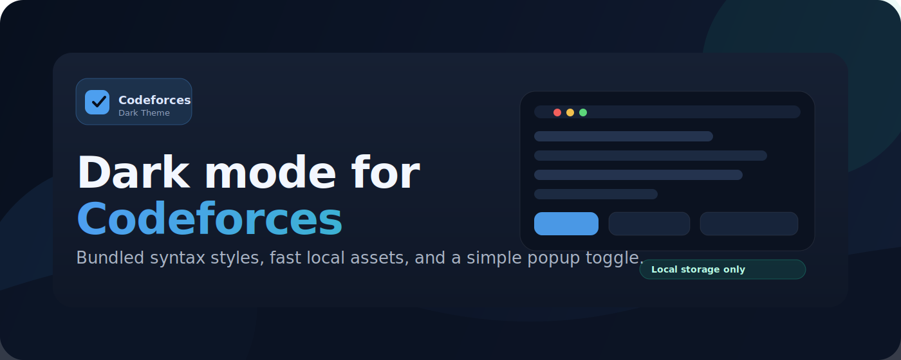
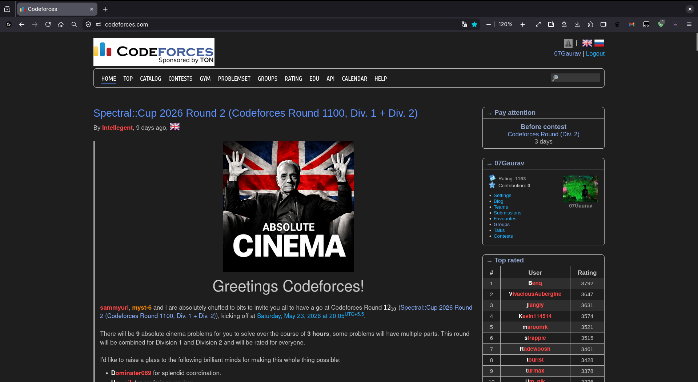

# Codeforces Dark Theme

## Overview

This repository provides a dark theme for Codeforces packaged as a small browser extension. All runtime assets used by the extension are bundled locally in the `extension/` folders (`darktheme.css`, `desert.css`, `monokai.css`, and `content.js`).

This is the extension version of Codeforces Dark Theme. If you want the userscript version, see the original project: https://github.com/GaurangTandon/codeforces-darktheme

## Screenshot

## Quick install (developer mode)

### Chrome / Edge / Brave

1. Download `codeforces-darktheme-extension.zip` from releases:  
   [Releases](https://github.com/gaurav7902/codeforces-darktheme/releases/tag/v1.0.1-5cd9d85) or directly: [Zip download](https://github.com/gaurav7902/codeforces-darktheme/releases/download/v1.0.0/codeforces-darktheme-extension.zip)
2. Unzip the file to a local folder.
3. Open your Chromium-based browser (Chrome, Edge, Brave) and go to `chrome://extensions/`, or `edge://extensions/`, or `brave://extensions/` as appropriate.
4. Enable "Developer mode" (top right).
5. Click "Load unpacked" and select `manifest.json` from the unzipped folder.
6. Open https://codeforces.com, toggle the extension, and confirm the dark theme is applied.

### Firefox (temporary)

1. Download `codeforces-darktheme-extension.zip` from releases:  
   [Releases](https://github.com/gaurav7902/codeforces-darktheme/releases/tag/v1.0.1-5cd9d85) or directly: [Zip download](https://github.com/gaurav7902/codeforces-darktheme/releases/download/v1.0.0/codeforces-darktheme-extension.zip)
2. Unzip the file to a local folder.
3. Open `about:debugging#/runtime/this-firefox` in Firefox.
4. Click "Load Temporary Add-on..." and pick `manifest.json` from the unzipped folder.
5. Open https://codeforces.com, toggle the extension, and confirm the dark theme is applied.

## Sources and licenses

- **This repository**: The extension code and packaging are licensed under the MIT License. See [LICENSE](LICENSE).
- **Original theme source**: The original Codeforces dark theme used as a source for `darktheme.css` and image assets is MIT-licensed: [Upstream license](https://github.com/GaurangTandon/codeforces-darktheme/blob/master/LICENSE).
- **Third-party styles**: Two syntax-highlighting styles are bundled and documented in [THIRD_PARTY_LICENSES.md](THIRD_PARTY_LICENSES.md):
    - Google Code Prettify (`desert.css`) — Apache License 2.0 (https://github.com/google/code-prettify)
    - Ace editor theme (`monokai.css`) — BSD-style (Ajax.org / ACE) (https://github.com/ajaxorg/ace)

## Contributing

Contributions are welcome! Feel free to fork, improve, and submit pull requests.

## Notes

- The `extension` folder contain the unpacked extension files and the third-party styles packaged locally.
- If you redistribute this extension, please respect and include the third-party licenses (see [THIRD_PARTY_LICENSES.md](THIRD_PARTY_LICENSES.md)).

## Store listing copy

- **Short description**: Dark theme for Codeforces with bundled syntax highlighting styles and a simple on/off popup.
- **Long description**: Codeforces Dark Theme is a lightweight browser extension that applies a dark, high-contrast reading and coding experience to Codeforces. It ships all runtime assets locally, including theme CSS and editor styling, and lets you enable or disable the theme from the popup. The extension is minimal, fast, and easy to install in developer mode.

## Privacy

The extension stores a single preference locally in `chrome.storage.local` / `browser.storage.local` and does not collect, transmit, or sell personal data. It does not include a background/service worker that sends data, and it contains no remote analytics or tracking scripts — all runtime assets are bundled locally in the `extension/` folder (see [extension/manifest.json](extension/manifest.json)). The only permission requested is `storage`; no host permissions are required.

---

For packaging scripts and other resources see the project root (Example: `generate-extension-zip.sh`).

## Authors

   <table><tr>
      <td></td>
      <td style="padding-left:12px">
         <h3><a href="https://github.com/gaurav7902">gaurav7902</a></h3>
         
Maintainer • Open to contributions

         

      </td>
   </tr></table>

## License

[MIT License](LICENSE)
